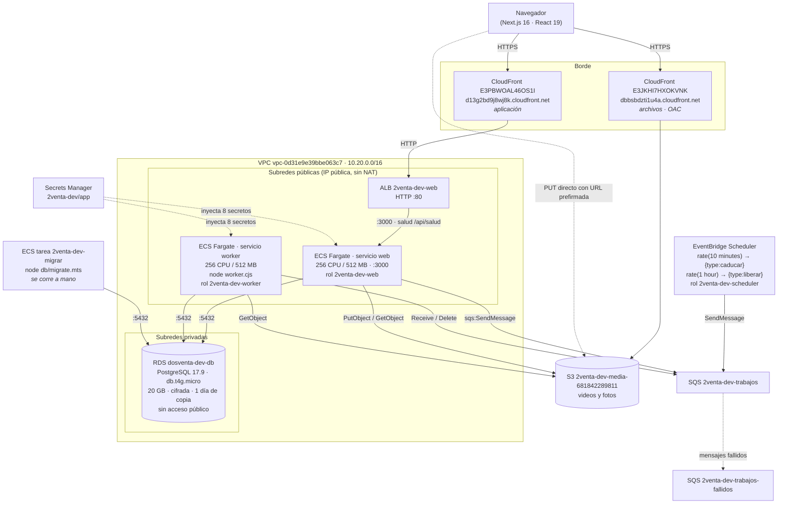

# 1. Arquitectura general

**Imagen:** [01-arquitectura-general.png](img/01-arquitectura-general.png) · [.svg](img/01-arquitectura-general.svg)

**Generado:** 2026-09-18 · **Entorno retratado:** `dev` (el único desplegado)
**Imagen en ejecución:** `2venta:main-5ef5748`

> Todo lo de este documento sale del repositorio o de la CLI de AWS contra la
> cuenta `681842289811`, región `us-east-1`.
>
> **Corrección aplicada tras comprobar:** una primera versión dibujaba el
> EventBridge Scheduler llamando a `POST /api/tareas/liberar`. Es falso.
> `aws scheduler get-schedule` demuestra que encola **directamente en SQS**. La
> ruta `/api/tareas/liberar` existe en el código, pero nada de lo desplegado la
> invoca según lo que se pudo comprobar. Lo que no se pudo confirmar está en
> «Lo que no se pudo verificar», al final, y **no** aparece dibujado.

## Evidencia

| Componente | De dónde sale |
|---|---|
| CloudFront `d13g2bd9j8wj8k` → ALB | `aws cloudfront get-distribution-config --id E3PBWOAL46OS1I` → origen `2venta-dev-web-1640579063.us-east-1.elb.amazonaws.com`, `http-only` |
| CloudFront `dbbsbdzti1u4a` → S3 | `--id E3JKHI7HXOKVNK` → origen `2venta-dev-media-681842289811.s3...`, con OAC `E2D9CAK7EPSR5I` |
| ALB → ECS :3000 | `aws elbv2 describe-listeners` → `HTTP:80`; `describe-target-groups` → `2venta-dev-web`, puerto 3000, tipo `ip`, salud `/api/salud` |
| Servicios ECS | `aws ecs list-services --cluster 2venta-dev` → `web`, `worker` (ambos `desiredCount=1`, `runningCount=1`, FARGATE) |
| Contenedores | `aws ecs describe-task-definition` de `2venta-dev-web`, `-worker`, `-migrar` |
| RDS | `aws rds describe-db-instances --db-instance-identifier dosventa-dev-db` → postgres 17.9, `db.t4g.micro`, `PubliclyAccessible:false` |
| Colas | `aws sqs list-queues` → `2venta-dev-trabajos`, `2venta-dev-trabajos-fallidos` |
| Programaciones | `aws scheduler get-schedule` → destino `arn:aws:sqs:...:2venta-dev-trabajos`, entradas `{"type":"caducar"}` con `rate(10 minutes)` y `{"type":"liberar"}` con `rate(1 hour)` |
| Tipos de trabajo | `src/worker/handlers.ts`: `liberar`, `caducar`, `avisar`, `transcodificar`, `video_listo` |
| Rutas de entrada | `find src/app -name route.ts` (12 rutas, listadas abajo) |



## Rutas de entrada reales

De `find src/app -name "route.ts"`:

```
/api/salud                    /api/auth/[...all]
/api/pagos/webhook            /api/pagos/destacar
/api/envios/webhook           /api/kyc/webhook
/api/tareas/liberar           /api/admin/reportes.csv
/api/dev/pago-callback        /api/dev/envio-callback
/api/dev/kyc-callback         /api/dev/destacar-callback
```

Las cuatro `/api/dev/*` son puentes de desarrollo; según `src/lib/env.ts` su
existencia depende de `APP_ENV`. En la tarea desplegada `APP_ENV=desarrollo`
(`aws ecs describe-task-definition --query '...containerDefinitions[0].environment'`),
**así que esas cuatro rutas existen en `dev`**.

Valores confirmados de las seis variables de entorno:

| Variable | Valor |
|---|---|
| `APP_ENV` | `desarrollo` |
| `AWS_REGION` | `us-east-1` |
| `S3_BUCKET` | `2venta-dev-media-681842289811` |
| `MEDIA_BASE_URL` | `https://dbbsbdzti1u4a.cloudfront.net` |
| `BETTER_AUTH_URL` | `https://d13g2bd9j8wj8k.cloudfront.net` |
| `SQS_QUEUE_URL` | `https://sqs.us-east-1.amazonaws.com/681842289811/2venta-dev-trabajos` |

## Lo que el diagrama NO dibuja, y por qué

- **Amplify Hosting:** `aws amplify list-apps` devuelve `{"apps": []}`. No hay
  ninguna aplicación. No se usa.
- **App Runner:** `aws apprunner list-services` falla con
  `SubscriptionRequiredException`. El servicio no está disponible en esta cuenta.
- **NAT Gateway:** `aws ec2 describe-nat-gateways` no devuelve ninguno. Las tareas
  salen a internet con IP pública (`assignPublicIp: ENABLED`).
- **Entorno `prod`:** no existe ningún recurso. Un solo clúster (`2venta-dev`) y una
  sola base (`dosventa-dev-db`); `us-west-2`, `sa-east-1` y `eu-west-1` tienen 0
  clústeres.
