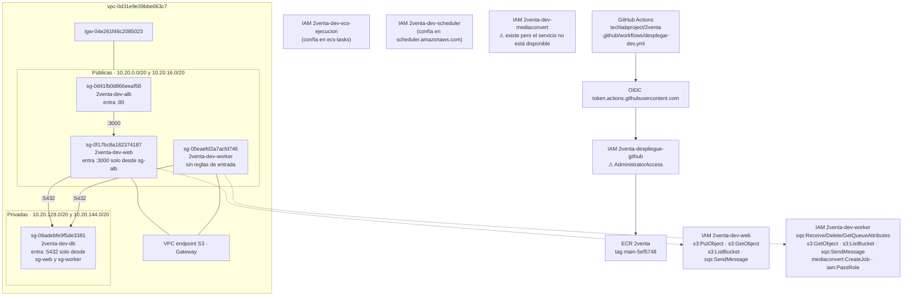

# 2. Integración con AWS

**Imagen:** [02-integracion-aws.png](img/02-integracion-aws.png) · [.svg](img/02-integracion-aws.svg)

**Cuenta:** 681842289811 · **Región:** us-east-1 · **Perfil CLI:** `2venta`
**Identidad usada:** `arn:aws:iam::681842289811:user/nicolas-cli`

> Todos los nombres de recurso de este documento se leyeron por CLI. Ninguno está
> inventado ni deducido del código de Terraform.

## Evidencia

| Dato | Comando |
|---|---|
| VPC, subredes, IGW | `aws ec2 describe-subnets --filters Name=vpc-id,Values=vpc-0d31e9e39bbe063c7`; `describe-internet-gateways` → `igw-04e261f46c2085023` |
| Sin NAT | `aws ec2 describe-nat-gateways --filter Name=vpc-id,...` → vacío |
| Endpoint de S3 | `aws ec2 describe-vpc-endpoints` → `com.amazonaws.us-east-1.s3`, tipo `Gateway` |
| Grupos de seguridad y reglas | `aws ec2 describe-security-groups` (5 grupos) + `IpPermissions` de cada uno |
| Red de los servicios | `aws ecs describe-services --cluster 2venta-dev --services web worker` |
| Roles y permisos | `aws iam list-roles`, `get-role-policy`, `list-attached-role-policies`, `get-role` |
| Registro de imágenes | `aws ecr describe-repositories` → `2venta` |
| Secretos | `aws secretsmanager list-secrets` → `2venta-dev/app` (**solo el nombre; nunca se leyó ningún valor**) |

## Red y permisos

## Inventario de recursos, con nombres reales

| Servicio | Recurso | Detalle confirmado |
|---|---|---|
| ECS | clúster `2venta-dev` | servicios `web` y `worker`, ambos FARGATE, 1/1 en ejecución |
| ECS | `2venta-dev-web` | 256 CPU / 512 MB, `awsvpc`, puerto 3000 |
| ECS | `2venta-dev-worker` | 256 CPU / 512 MB, `node worker.cjs` |
| ECS | `2venta-dev-migrar` | `node db/migrate.mts`, usa el rol `2venta-dev-web` |
| ELB | `2venta-dev-web` | application, internet-facing, listener HTTP:80 |
| CloudFront | `E3PBWOAL46OS1I` | «2venta-dev aplicación» → ALB, `http-only` |
| CloudFront | `E3JKHI7HXOKVNK` | «2venta-dev archivos» → S3 con OAC `E2D9CAK7EPSR5I` |
| RDS | `dosventa-dev-db` | postgres 17.9, `db.t4g.micro`, 20 GB, cifrada, 1 día de copia, sin Multi-AZ, sin acceso público |
| S3 | `2venta-dev-media-681842289811` | medios |
| S3 | `2venta-terraform-681842289811` | estado de Terraform |
| SQS | `2venta-dev-trabajos` | cola de trabajo |
| SQS | `2venta-dev-trabajos-fallidos` | cola de fallidos |
| Scheduler | `2venta-dev-caducar-cada-10-min` | `rate(10 minutes)` → SQS `2venta-dev-trabajos` con `{"type":"caducar"}` |
| Scheduler | `2venta-dev-liberar-cada-hora` | `rate(1 hour)` → SQS `2venta-dev-trabajos` con `{"type":"liberar"}` |
| Secrets Manager | `2venta-dev/app` | 8 claves inyectadas en las tareas (solo nombres) |
| ECR | `2venta` | imagen desplegada `main-5ef5748` |

## Dos observaciones que salieron de mirar, no de suponer

1. **`2venta-despliegue-github` tiene `AdministratorAccess`.** Es el rol que asume
   GitHub Actions por OIDC. Cualquiera capaz de disparar un workflow en un
   repositorio **público** ejecuta acciones con permisos totales sobre la cuenta.
   No lo arreglo aquí porque no se pidió, pero conviene decidirlo.
2. **`2venta-dev-mediaconvert` existe y el worker tiene `mediaconvert:CreateJob`,
   pero `aws mediaconvert describe-endpoints` falla con
   `SubscriptionRequiredException`.** El camino de transcodificación está
   aprovisionado y no puede ejecutarse en esta cuenta.

## Secretos inyectados (nombres, nunca valores)

De `describe-task-definition`, las tres definiciones reciben los mismos ocho:
`BETTER_AUTH_SECRET`, `CRON_SECRET`, `KYC_WEBHOOK_SECRET`,
`PAYMENTS_WEBHOOK_SECRET`, `PHONE_CODE_SECRET`, `PICKUP_CODE_SECRET`,
`SHIPPING_WEBHOOK_SECRET`, `DATABASE_URL`.

Y seis variables de entorno, cuyos valores sí se consultaron (no son secretos) y
están en el diagrama 1: `APP_ENV=desarrollo`, `AWS_REGION=us-east-1`,
`S3_BUCKET=2venta-dev-media-681842289811`,
`MEDIA_BASE_URL=https://dbbsbdzti1u4a.cloudfront.net`,
`BETTER_AUTH_URL=https://d13g2bd9j8wj8k.cloudfront.net`, `SQS_QUEUE_URL=...`.
