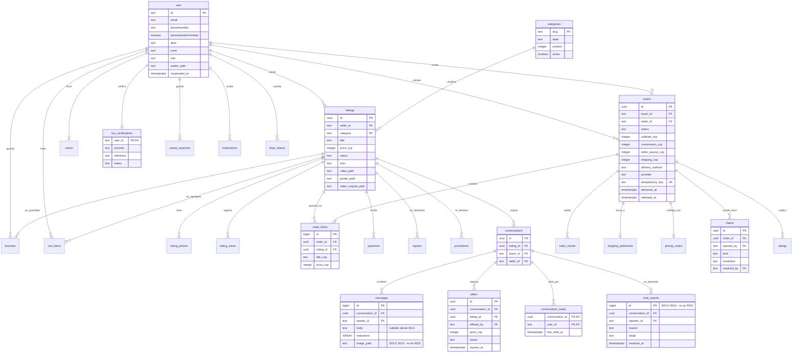

# 3. Modelo de datos

**Imagen:** [03-modelo-de-datos.png](img/03-modelo-de-datos.png) · [.svg](img/03-modelo-de-datos.svg)

> **Advertencia sobre la fuente.** `dosventa-dev-db` tiene
> `PubliclyAccessible: false` y vive en subredes privadas, así que **no se pudo
> consultar el esquema desplegado**. Lo que sigue se leyó del
> `information_schema` de la base local, que aplica las mismas migraciones
> numeradas del repositorio.
>
> **Hay una diferencia conocida:** la imagen desplegada es `main-5ef5748`, que
> incluye migraciones `0001`–`0012`. La `0013_fotos_y_reportes_de_chat.sql` está
> en el árbol de trabajo **sin confirmar**, así que `messages.image_path`,
> `chat_reports` y la restricción `messages_con_algo_dentro` **existen abajo pero
> todavía no en RDS**. Van marcadas.

## Evidencia

- Tablas: `select table_name from information_schema.tables where table_schema='public'` → 35 tablas.
- Claves foráneas: consulta sobre `information_schema.table_constraints` + `key_column_usage` + `constraint_column_usage` → 48 relaciones.
- Columnas: `information_schema.columns` por tabla.
- Migraciones confirmadas: `git ls-files db/migrations/` → `0001`…`0012`.
- Migración sin confirmar: `git status --short db/migrations/` → `?? 0013_fotos_y_reportes_de_chat.sql`.

## Dominio del producto

## Tablas que no son del dominio

Cinco tablas las genera Better Auth o el propio sistema de migraciones, no el
modelo de negocio. Se listan aparte para no ensuciar el diagrama:

| Tabla | Origen |
|---|---|
| `account`, `session`, `verification`, `rateLimit` | esquema de Better Auth (`account.userId → user.id`, `session.userId → user.id`) |
| `migrations` | control de migraciones aplicadas |

Y otras siete del dominio que sí tienen clave foránea pero cuyos atributos no se
detallan arriba por espacio: `phone_codes`, `recovery_codes`, `otp_sends`,
`listing_photos`, `listing_views`, `user_reports`, `order_events`,
`shipping_addresses`, `pickup_codes`, `promotions`, `questions`, `ratings`,
`reports`, `saved_searches`, `favorites`, `cart_items`, `stores`,
`alias_history`, `notifications`. Todas sus relaciones sí están dibujadas o
listadas en la evidencia de claves foráneas.

## Detalle que conviene no perder

`order_items.title_cop` guarda el **título** del artículo, no un monto, pese al
sufijo `_cop` que en el resto del esquema significa «pesos colombianos». Es una
inconsistencia de nombre real y confirmada en `information_schema` (`data_type:
text`).
