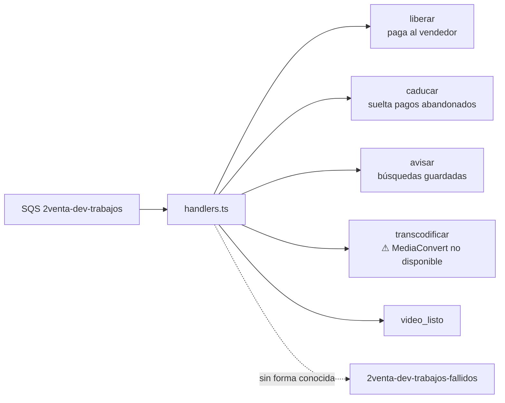

# 4. Módulos del backend

**Imagen:** [04-modulos-backend.png](img/04-modulos-backend.png) · [.svg](img/04-modulos-backend.svg) · [05-worker-trabajos.png](img/05-worker-trabajos.png) · [.svg](img/05-worker-trabajos.svg)

> **Sobre «UML de clases».** Se pidió un diagrama de clases. En este código
> **no hay clases**: `grep -rn "^export class\|^class " src --include='*.ts'`
> devuelve **una sola**, `UploadError extends Error` en
> `src/features/publish/useUpload.ts`, que es un tipo de error, no un modelo.
>
> El backend es un monolito modular de funciones: cada rebanada vertical es una
> carpeta en `src/features/` con `actions.ts` (acciones de servidor),
> `queries.ts` (lectura) y sus componentes. Dibujar clases aquí sería inventar una
> estructura que el código no tiene, así que el diagrama es de **módulos y sus
> dependencias reales**.

## Evidencia

- Ausencia de clases: `grep -rn "^export class\|^class " src --include='*.ts'` → 1 resultado.
- Módulos: `ls src/features/*/` → 22 carpetas.
- Núcleo: `ls src/lib/*.ts` → 14 archivos.
- Aristas: `grep -rhoE 'from "@/(features/[a-z]+|lib/[a-z-]+|worker)' src/features src/worker` agregado por destino.
- Trabajos del worker: `grep -n 'case "' src/worker/handlers.ts` → 5 casos.
- Proveedores externos: `src/features/{kyc,payments,shipping,video}/provider.ts`.

## Módulos y dependencias

```mermaid
flowchart TB
    subgraph entrada["Entrada (src/app)"]
        pages["Páginas del App Router<br/>renderizado en servidor"]
        api["12 rutas API<br/>webhooks · salud · tareas · CSV"]
    end

    subgraph features["src/features · 22 rebanadas verticales"]
        direction LR
        catalog["catalog<br/>queries · search · labels"]
        payments["payments<br/>orders · money · release<br/>abandon · provider"]
        chat["chat<br/>actions · queries<br/>redact · Burbujas"]
        publish["publish<br/>actions · claim<br/>upload · photos"]
        kyc["kyc"]
        shipping["shipping"]
        pickup["pickup"]
        claims["claims"]
        moderation["moderation<br/>rules · imei"]
        alerts["alerts"]
        otros["auth · cart · favorites<br/>metrics · orders · pricing<br/>profile · promotions · ratings<br/>reports · store · video"]
    end

    subgraph lib["src/lib · núcleo compartido"]
        db["db.ts<br/><b>39 importaciones</b>"]
        session["session.ts<br/><b>18 importaciones</b>"]
        storage["storage.ts · 6"]
        queue["queue.ts · 4"]
        money["money.ts · 4"]
        resto["auth · config · env · media<br/>sms · otp-rate-limit · tiempo · boot"]
    end

    worker["src/worker<br/>index.ts · handlers.ts"]

    pages --> features
    api --> features
    features --> db
    features --> session
    publish --> storage
    payments --> queue
    payments --> money
    worker --> features

    chat -.->|16| payments
    chat -.->|11| catalog

    subgraph ext["Proveedores externos (provider.ts)"]
        pKyc["kyc/provider.ts"]
        pPay["payments/provider.ts"]
        pShip["shipping/provider.ts"]
        pVid["video/provider.ts"]
    end

    kyc --> pKyc
    payments --> pPay
    shipping --> pShip
    publish --> pVid
```

## El worker y sus cinco trabajos

De `src/worker/handlers.ts`, confirmados uno a uno:

`caducar` y `liberar` los dispara EventBridge Scheduler (ver diagrama 2). Los
otros tres los encola la aplicación.

## La regla que sostiene la estructura

`src/worker/` solo llama funciones de `src/features/*` — lo dice `CLAUDE.md` y lo
confirma que `grep` sobre `src/worker` encuentre importaciones a `features` y a
`lib`, pero ninguna lógica de negocio propia en `handlers.ts` más allá del
despacho por tipo.

## Lo que este diagrama no puede afirmar

Las aristas salen de contar importaciones estáticas por módulo destino. **No**
reflejan llamadas en tiempo de ejecución ni el sentido de cada dependencia dentro
de un mismo módulo. Un grafo exacto de dependencias necesitaría analizar el AST,
que no se hizo.
